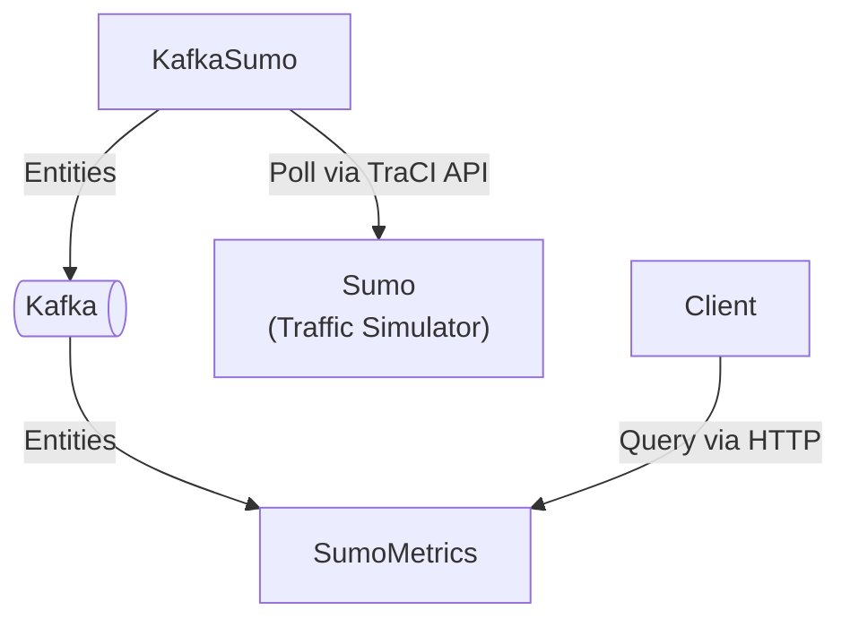

# kafka-playground



## Usage

```shell
make build
docker compose up -d

# Test some endpoints
curl -X GET http://localhost:5000/metrics/vehicles/speed/avg | jq .
curl -X GET http://localhost:5000/metrics/traffic-lights/lanes/vehicles | jq .
```

